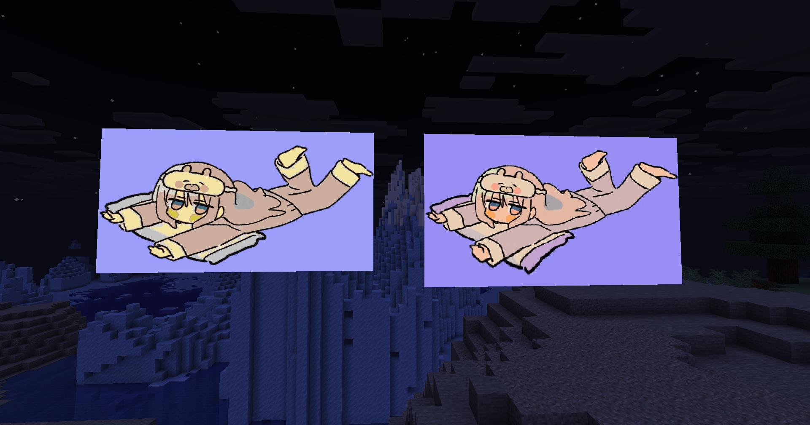
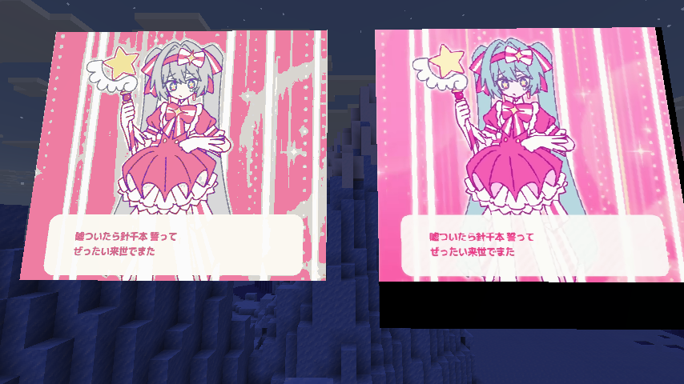

# Danta-Shader
미니게임(단타) 에서 사용될 여러 쉐이더를 한 프로젝트로 합친 모드입니다.

## DisplayHud

출처 : https://github.com/dorondo0000/DisplayHUD


## RGBMapUtils

출처 : https://github.com/JNNGL/vanilla-shaders
https://github.com/biryeongtrain/RGBMapUtils





## ShaderFX

[](https://www.youtube.com/watch?v=3GpW_6qgs80)

## How to use

```groovy
repositories {
    maven ( url "https://repo.biryeong.kim/releases/")
}

dependencies {
    implementation include 'kim.biryeong:danta-shader:1.0.0'
}
 
```

ShaderFX : just use command `/shaderfx run`
RGBMapUtils, DisplayHud : 테스트 커멘드 확인해서 예시 참조